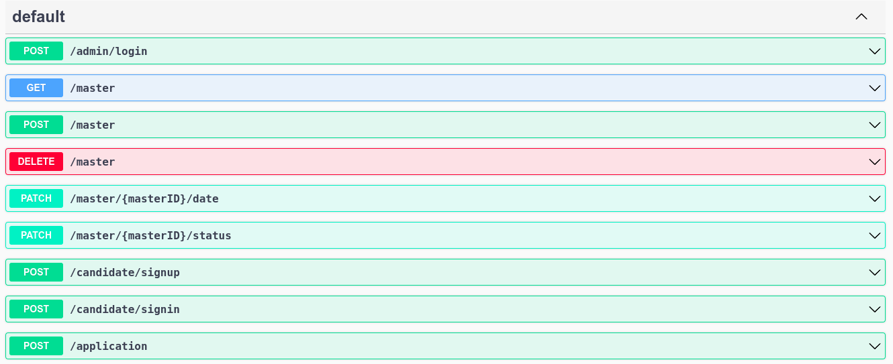

# Master Management Rest API

this API allows :

- admin to manage candidates application for master degrees

  - accept application
  - reject application
  - open new master for candidates
  - close (delete) master

- candidates to apply for master degrees
  - apply for a master degree
  - cancel application for master degree

## Documentation

[Swagger API Documentation](http://localhost:3000/api) : localhost:3000/api

## Screenshots



## Installation

Install project dependencies

```bash
  npm install
```

Run Postgress and Adminer with docker compose

```
  docker compose up -d
```

run project

```
  npm run start:dev
```
